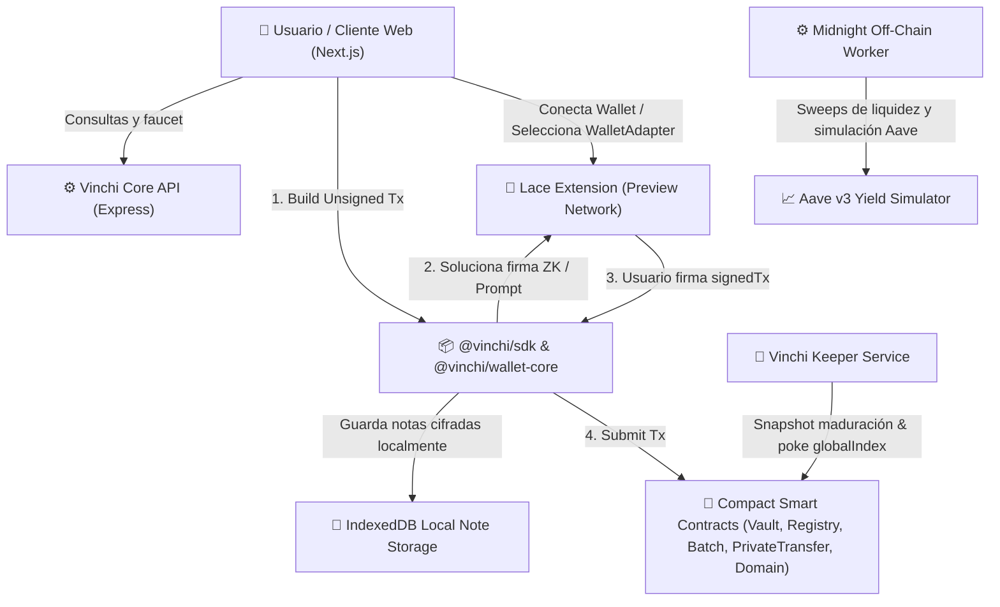

# Arquitectura General de Vinchi Protocol

Vinchi es un protocolo de **Factoring Privado de Rendimiento Futuro (Advance Yield Protocol)** construido sobre **Midnight Network (Preview Testnet)** utilizando **Midnight Compact Smart Contracts (Compact 0.23)**.

## Diagrama de Arquitectura

## Firma Obligatoria con Lace

Todas las operaciones iniciadas por el usuario se construyen como transacciones sin firmar (`unsignedTx`) y se envían a Lace Extension para su aprobación explícita.

### Flujo Estándar:
$$\text{Frontend} \xrightarrow{\text{buildUnsignedTx}} \text{Lace.signTx} \xrightarrow{\text{signedTx}} \text{SubmitTx} \rightarrow \text{Midnight Network}$$

> [!IMPORTANT]
> **Ninguna clave privada se almacena en el frontend ni en el backend.** El usuario mantiene la custodia total de sus llaves en la extensión Lace en todo momento.

### Operaciones que requieren firma explícita del usuario (Lace Signature Popup):
1. **Mint de USDC de prueba** (`USDCMint.compact`).
2. **Registro en el Ecosistema** (`Registry.compact`).
3. **Depósito y adelanto de Yield** (`Vault.deposit`).
4. **Transferencia Privada lUSDv** (`PrivateTransfer.compact`).
5. **Pago a Comercio / Dominio** (`cafe.midnight`).
6. **Registro de Dominio** (`DomainRegistry.registerDomain`).
7. **Retiro de mUSDv** (`Vault.redeem`).

### Operaciones automáticas ejecutadas por el Keeper:
- Snapshot de maduración de lotes (`snapshotYieldIndex`).
- Actualización del índice global de rendimiento (`pokeGlobalYieldIndex`).
- Tareas de mantenimiento del protocolo.
