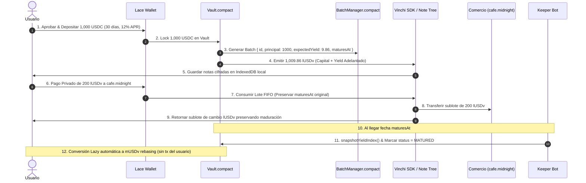

# Flujo de Fondos (Yield Layer & Factorización)

## Diagrama de Flujo de Fondos

## Motor de Rendimiento Adelantado (Fórmula)

$$\text{futureYield} = \frac{\text{amount} \times \text{APR} \times \text{días}}{365}$$

$$\text{lUSDv Minted} = \text{amount} + \text{futureYield}$$

### Ejemplo Práctico:
- Depositado: **1,000 USDC**
- Plazo: **30 Días** (APR 12%)
- Rendimiento Adelantado: **9.86 USDC**
- lUSDv Recibidos de inmediato: **1,009.86 lUSDv**
